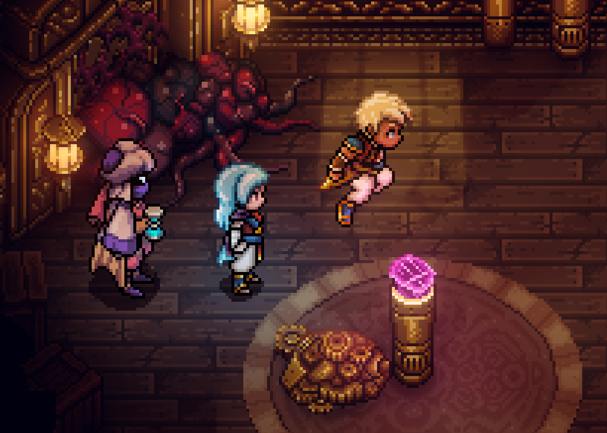
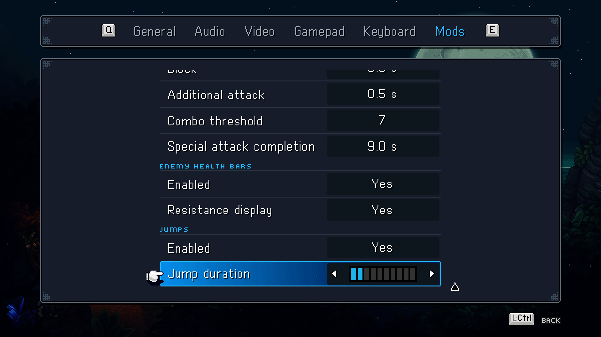

# Sea of Stars: JustWanaJump

JustWanaJump lets you jump while exploring in Sea of Stars. Press the normal Interact button when there is nothing to interact with. The party leader will use the game's own jump animation.

## Features

- Cosmetic jumping during normal exploration outside combat
- Stationary and eight-direction movement support through the game's native animations
- Safe visual arc that never moves the player root, collider, navigation state, or ground position
- Native interactions, climbs, drops, scripted jumps, swimming, cutscenes, and other game states keep priority
- Native-styled **Mods** tab that is created when needed and shared with compatible mods
- In-game enable toggle and native segmented duration slider
- Adjustable jump duration from 0.3 to 0.6 seconds
- Settings localized for every language supported by the game

## Screenshots

### Jumping during exploration

### Shared Mods page and duration slider

## Requirements

- Sea of Stars for Windows
- BepInEx 6 for IL2CPP, including generated interop assemblies
- .NET 6 SDK for source builds

## Installation

1. Install BepInEx 6 for IL2CPP and run Sea of Stars once.
2. Extract the release archive into the Sea of Stars game directory.
3. Confirm that `BepInEx/plugins/CosmeticJump/CosmeticJump.dll` exists.
4. Start the game and open **Options**, then **Mods**.

## Controls and settings

Press the normal Interact button while freely exploring. If the game can interact with an object or begin a native movement action, the game handles that input and the mod does not start a cosmetic jump.

The **JustWanaJump** section in **Options > Mods** contains:

- **Enabled**: turns cosmetic jumping on or off.
- **Jump duration**: a native segmented slider covering 0.3 to 0.6 seconds. The default is 0.6 seconds.

The configuration file is stored at `BepInEx/config/local.seaofstars.cosmeticjump.cfg`.

## Compatibility and scope

The mod does not modify game files, save files, collision, movement permissions, or Steam achievement data. Because only the visual child is offset, cosmetic jumps cannot cross walls, climb ledges, leave walkable ground, or bypass the game's normal traversal rules.

The Mods page follows the same shared-tab convention as Improved Parries and Blocks and Enemy Health Bars. Each installed compatible mod keeps its own section on one scrollable page.

## Build from source

See [Building](docs/BUILDING.md). The repository intentionally excludes game binaries, generated interop assemblies, build output, and release payloads.

## Localization

The in-game settings are localized for English, Japanese, Russian, Korean, French, Quebec French, German, Spanish, Brazilian Portuguese, Simplified Chinese, Traditional Chinese, and Italian.

## License

The project may be used, inspected, forked, and modified solely for personal, non-commercial purposes. Commercial use, sale, monetization, repackaging, and inclusion in third-party mod packs or software bundles are prohibited. See [LICENSE](LICENSE) for the complete terms.

This is an unofficial fan-made mod and is not affiliated with Sabotage Studio. Sea of Stars and its assets belong to their respective rights holders.
